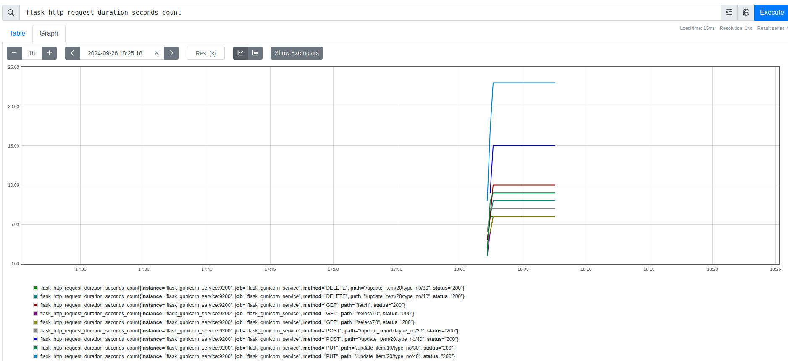

## Prometheus Flask Gunicorn metrics
Gather Prometheus HTTP metrics for Flask Gunicorn web server.



Docker compose file has two service
- **flask_gunicorn_service**: Python flask web server with Gunicorn
- **prometheus**: Prometheus for gathering metrics

After the services are brought up, access the Prometheus dashboard at `127.0.0.1:9090`

---

### Prometheus with Flask and Gunicorn
As Prometheus needs to gather the metrics from all Gunicorn worker processes, it needs special configuration like a writable directory for storing db metrics from all processes, and new http server for exposing the metrics. Pass both these variables as environmental variables in `.env` file. 

```
PROMETHEUS_METRICS_PORT=9200
PROMETHEUS_MULTIPROC_DIR=/opt/prometheus_metrics
```

Prometheus can gather the metrics for this component through the port `9200` and this needs to be configured in Prometheus configuration file as

```
job_name: flask_gunicorn_service
    scrape_interval: 5s
    static_configs:
        - targets: ['flask_gunicorn_service:9200']
```

In the gunicorn config file `gunicorn.conf.py` config the Prometheus for multiprocess by starting the http server for Prometheus when server ready.

In `/app/metrics/flask_prometheus_metrics.py` file, add the custom metrics in the `FlaskPrometheusMetrics` class and function `initialize_custom_metrics()`.

In the `/app/app.py`, the `FlaskPrometheusMetrics` is initilized at the end of the all endpoints definition, if not then the custom metrics don't track these endpoints.

#### Ref:
- [https://www.metricfire.com/blog/monitoring-python-web-app/](https://www.metricfire.com/blog/monitoring-python-web-app/)
- [https://www.cloudbees.com/blog/monitoring-your-synchronous-python-web-applications-using-prometheus](https://www.cloudbees.com/blog/monitoring-your-synchronous-python-web-applications-using-prometheus)